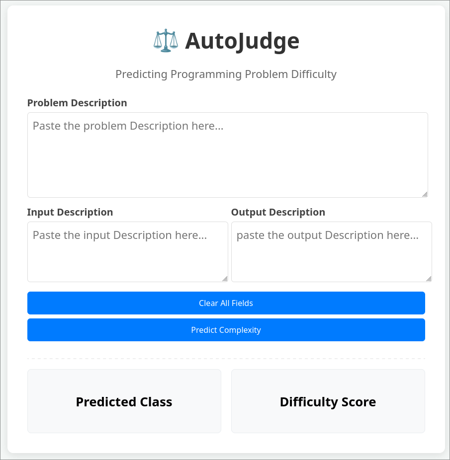

# ⚖️ AutoJudge: CP Problem Difficulty Estimator

## 📌 Project Overview

**AutoJudge** is a machine learning project designed to predict the difficulty of competitive programming (CP) problems by analyzing their textual content, including:
- Problem description

- Input description(with constraints)

- Output description

This ml project perfoms two simultaneous task of predicting difficulty:

1.  **Problem Class** (Classification): Categorizes problems into _Easy_, _Medium_, or _Hard_.
2.  **Problem Score** (Regression): Predicts the difficulty score between 1 to 10.

The system combines:

  - Text-based features (TF-IDF)

  - Length-based features (word counts, sentence counts)

  - Domain-specific features (keywords, constraints, modulo usage, limits)

Multiple machine learning models are trained and evaluated, and the best-performing models are exported for deployment.

A web interface allows users to paste a new problem statement and instantly receive predicted difficulty class and score.


## 📂 Dataset Used

The project utilizes a dataset of competitive programming problems (`problems_data.jsonl`) containing:

- **Description:** Full textual description of the problem statement.
- **Input_description:** Explanation of the input format and constraints.
- **Output_description:** Explanation of the expected output format.
- **Tags/Class:** Difficulty category of the problem: 
    - _Easy_
    -  _Medium_
    - _Hard_
(_Easy_, _Medium_, or _Hard_).
- **Score:** A numerical difficulty score (1-10) representing the relative hardness of the problem.


## ⚙️ Approach & Models used
This project uses a **classical machine learning approach with feature engineering** on problem statements, rather than deep NLP or transformer-based models.
### 1. Data Preprocessing & Cleaning
The difficulty prediction is performed using **statistical text representations (TF-IDF)** combined with **manually engineered domain-specific features** extracted from competitive programming problems.

---

### 🔹 Feature Engineering

Three categories of features are used:
---

### 📝 1. Text Vectorization (TF-IDF)

- Problem text is formed by concatenating:
  - `description`
  - `input_description`
  - `output_description`
- Text preprocessing includes:
  - Lowercasing
  - Tokenization (NLTK)
  - Stopword removal
  - Stemming (Porter Stemmer)
  - Custom rules to preserve competitive programming constructs such as:
    - `10^5`, `10^9 + 7`, `998244353`
    - Mathematical operators and variables (`n`, `m`, `k`)
- Cleaned text is converted into numerical features using:
  - **TF-IDF Vectorizer (`max_features = 3000`)**

This captures the importance of words without using deep language models.

---

### 📏 2. Length-Based Statistical Features

To capture structural complexity of problems, the following features are added:

- Word count in problem description
- Word count in input description
- Word count in output description

These features help differentiate simple problems from long, constraint-heavy ones.

---

### 🧠 3. Domain-Specific Keyword & Constraint Features

Competitive programming knowledge is encoded using manually extracted features.

#### Keyword Frequency Features
Counts of important terms such as:
- Algorithms: `dp`, `greedy`, `binary search`, `dfs`, `bfs` ...
- Data structures: `array`, `tree`, `graph`, `segment tree` ...
- Problem patterns: `subarray`, `substring`, `bitmask`, `two pointers` ...

#### Constraint Indicators
Binary features detecting:
- Input size limits (`10^5`, `10^6`, `10^9`, `10^18`)
- Modulo arithmetic (`10^9 + 7`, `998244353`)
- Time and memory constraints

All non-text features are normalized using **MinMaxScaler** and concatenated with TF-IDF vectors.

---

### 🔹 Classification Models (Problem Class Prediction)

The classification task predicts:
**Easy / Medium / Hard**

The following models were trained and evaluated:

- Naive Bayes (Multinomial, Bernoulli)
- Logistic Regression
- Support Vector Machines (Linear, RBF, Sigmoid)
- K-Nearest Neighbors
- Decision Tree
- Random Forest (multiple configurations)
- Extra Trees Classifier
- Gradient Boosting Classifier
- XGBoost Classifier
- Voting Classifier (Random Forest + Extra Trees)

**Best performing classifiers:**
- **Random Forest Classifier**
- **Voting Classifier (RF + Extra Trees)**

These models handle high-dimensional text features, class imbalance, and non-linear relationships effectively.

---

### 🔹 Regression Models (Problem Score Prediction)

The regression task predicts a **numerical difficulty score**.

The following models were trained and evaluated:

- Linear Regression
- Ridge Regression
- Bayesian Ridge Regression
- Support Vector Regressor (SVR)
- K-Nearest Neighbors Regressor
- Decision Tree Regressor
- Random Forest Regressor (tuned)
- Extra Trees Regressor (tuned)
- Gradient Boosting Regressor
- XGBoost Regressor

**Best performing regressors:**
- Tuned **Gradient Boosting Regressor**
- Tuned **Extra Trees Regressor**

These achieved the lowest MAE and RMSE among tested models.

---

### 🔹 Why This Approach Works

- TF-IDF effectively captures important terms without requiring large datasets
- Length and constraint features represent problem complexity
- Tree-based ensemble models learn non-linear feature interactions
- The approach is interpretable, lightweight, and deployment-friendly

---

### 🔹 Model Export

Final models and preprocessing artifacts are saved using **Joblib**:
- Difficulty classifier
- Difficulty score regressor
- TF-IDF vectorizer
- Feature scaler
- Label encoder

These files are used directly by the web interface for real-time prediction.

## 📊 Evaluation Metrics

The models were evaluated separately for **classification** and **regression** tasks using standard machine learning metrics.
---
### 🔹 Classification Metrics (Problem Class)

| Metric       | Description                                                  |
|-------------|--------------------------------------------------------------|
| **Accuracy** | Percentage of correctly predicted difficulty classes (Easy / Medium / Hard) |

- Accuracy was computed using a stratified train–test split.
- Multiple models were compared, including SVM, Random Forest, Extra Trees, XGBoost, and ensemble methods.
- **Best performance was achieved using:**
  - Tuned **Random Forest Classifier**
  - **Voting Classifier (Random Forest + Extra Trees)**

---

### 🔹 Regression Metrics (Problem Score)

| Metric  | Description                                                        |
|-------|--------------------------------------------------------------------|
| **MAE** | Mean Absolute Error — average absolute difference between predicted and true scores |
| **RMSE** | Root Mean Squared Error — penalizes larger prediction errors       |
| **R²** | Measures how well the regression model explains variance in scores |

- Regression performance was evaluated using MAE, RMSE, and R² score.
- Multiple regressors were compared, including Linear, Ridge, SVR, Random Forest, Extra Trees, Gradient Boosting, and XGBoost.
- **Best performance was achieved using:**
  - Tuned **Gradient Boosting Regressor**
  - Tuned **Extra Trees Regressor**

---

## 🚀 Steps to Run the Project Locally

### 🔧 Prerequisites

- Python **3.8 or higher**
- pip
- Git

---

### 📦 Installation

#### 1. Clone the Repository

```bash
git clone https://github.com/manishkg27/Autojudge-project.git

cd autojudge
```


#### 2. Create a Virtual Environment (Recommended):

```bash
python -m venv venv
# Windows
venv\Scripts\activate
# Linux/Mac
source venv/bin/activate
  ```

#### 3.  **Install Dependencies:**

```bash
pip install -r requirements.txt
  ```

#### 4.  **Launch the Web Interface:**
```bash
python app.py
  ```
Once the server starts, open your browser and go to: 
http://127.0.0.1:8000 or ***ctrl + click*** on the link provided in your terminal.
## 💻 Web Interface

The project includes a **user-friendly web interface** built using **Flask** for the backend and **HTML, CSS, and JavaScript** for the frontend.
<p align="left">
  
</p>

### ✍️ Input Fields

The user provides the following inputs:

- **Problem Description**  
  Full statement describing the problem logic.

- **Input Description**  
  Explanation of input format and constraints.

- **Output Description**  
  Explanation of expected output.

---

### ⚙️ How It Works (Request Flow)

1. User enters the problem text and clicks **“Predict Complexity”**
2. Frontend sends a **POST request** to the Flask backend (`predict`)
3. Backend performs:
   - Text cleaning and normalization
   - TF-IDF vectorization
   - Feature extraction (length + domain-specific features)
   - Model inference using trained ML models
4. Backend returns a JSON response containing:
   - Predicted difficulty class
   - Predicted difficulty score
5. Results are displayed instantly on the UI without page reload

---

### 📤 Output Display

The results are shown in dedicated sections:

- **Predicted Class** → Easy / Medium / Hard  
- **Difficulty Score** → Numerical score (rounded to 2 decimals)

---

### 🧹 Additional Features

- **Clear All Fields** button to reset inputs
- Real-time prediction without page refresh
- Runs fully **locally** using Flask

## 🎥 Demo Video

[Link to 2-3 Minute YouTube/Drive Demo Video]

- 0:00 - 0:30: Project Introduction.

- 0:30 - 1:30:  Brief explanation of the code/model.

- 1:30 - 2:30: Walkthrough of the Web Interface (Testing a problem).
---

## 👨‍💻 Author

- **Name:** Manish Kumar Gupta

- 🎓 B.Tech Student, IIT Roorkee 
- **Email:** manish_kg@bt.iitr.ac.in
- **LinkedIn:** https://www.linkedin.com/in/manish-kumar-gupta-17ba45312?utm_source=share&utm_campaign=share_via&utm_content=profile&utm_medium=android_app
- Github: https://github.com/manishkg27
---

_Built with ❤️ using Python, Scikit-Learn, and Arch Linux(btw)._
